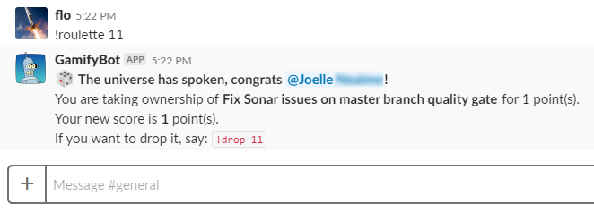

[//]: # "Documentation generated for version 1.0"


## The game

Once the bot is running and has been invited to **your team's Slack channels**, you will be able to interact with it using commands.

The principle of the game is that **anyone can insert tasks** when they arise, and then **it is up to team members to take ownership** of them.

Tasks are **inserted with a given number of points**, and a team member taking a task will see her/his **score incremented** by that much.

It is possible for a team member to **release ownership of a task** (dropping the task), but her/his **score will decrease** by the task points.

## Commands

| Command                                | Description                                                                                   | Usage
|----------------------------------------|-----------------------------------------------------------------------------------------------|-----------------------------
| [*!join*](#join_command)               | To **register your username** as a player in da game.                                         | `!join <user name>`
| [*!leave*](#leave_command)             | To **leave the game**, your user and score will be deleted.                                   | `!leave`
| [*!score*](#score_command)             | Will **print the high scores** tables.                                                        | `!score` or `!scores`
| [*!tasks*](#tasks_command)             | Will **print the pending tasks**.                                                             | `!tasks`
| [*!add*](#add_command)                 | Will **add a new task** to the backlog to earn points, which can then be taken by a player.   | `!add <points> <description>`
| [*!close*](#close_command)             | This **removes the task** from the backlog, no effect on scores.                              | `!close <task id>`
| [*!take*](#take_command)               | You are **taking this task**, your score will increase by the amount of points of the task.   | `!take <task id>`
| [*!drop*](#drop_command)               | You are **dropping this task**, your score will decrease by the amount of points of the task. | `!drop <task id>`
| [*!roulette*](#roulette_command)       | The **universe will assign** this task to someone (weighted random)!                          | `!roulette <task id>`
| [*!help*](#help_command)               | Prints the **list of commands**.                                                              | `!help`
| [*!admin:reset*](#admin_reset_command) | **Resets everybody's score to 0**. Cannot be reverted.                                            | `!admin!reset`

### <a name="join_command"></a> Register a username to join the game

Use the `!join` command to register a username that will be linked to you Slack user.

`!join <user name>`


### <a name="leave_command"></a> Leave the game

Use the `!leave` command to delete your user from the game and all your task assignments (your score is also lost in the process).

`!leave`


### <a name="add_command"></a> Add a task to the backlog

Use the `!add` command to add a task to the current backlog, you need to pass the following arguments to the command:

`!add <points> <description>`

This task can then be taken by any registered player, by using the returned **task id**.


### <a name="close_command"></a> Remove a task from the backlog

Use the `!close` command to remove a task from the backlog, you need to pass the following argument to the command:

`!close <taskId>`


### <a name="take_command"></a> Take ownership of a task

Use the `!take` command to become the owner of a given task, you will **earn the amount of points attached to the task** while doing so.

You need to pass the following argument to the command:

`!take <taskId>`


### <a name="drop_command"></a> Drop ownership of a task

Use the `!drop` command drop the ownership of a given task, you will **lose the amount of points attached to the task** while doing so.

You need to pass the following argument to the command:

`!drop <taskId>`


**Note**: If you are an **admin player** (as declared in the configuration file `./bot-config.yml`),
 you can cancel a task assignment on behalf of another player.

### <a name="roulette_command"></a> Roulette: let the universe decide!

Use the `!roulette` command to automatically assign the task to one of the team members.

The task is assigned randomly using a weighted random function, that will increase the probability of attributing 
the task to team members with the smallest scores.

The team member who gets assigned to the task **earns the amount of points attached to the task**.

You need to pass the following argument to the command:

`!roulette <taskId>`



### <a name="tasks_command"></a> Listing the tasks in the backlog

Use the `!tasks` command to get the list of tasks (assigned or not).

`!tasks`


### <a name="scores_command"></a> View the high scores table

Use the `!scores` command to get the high scores.

`!scores`


### <a name="admin_reset_command"></a> Reset all player scores

You may want to regularly **reset all player scores to 0** (for instance at every sprint planning / retro).

To do so, run the `!admin:reset` command, that can only be launched by an admin user,
as declared in the configuration file `./bot-config.yml`:

```yml
# Declare a list of Slack IDs here that can perform admin commands.
admin:
  - "U1477E508"
```

**Warning**: Once you reset the scores, you cannot go back.
